

  

  
  
  
  

<h1 align="center">
  Hey there! 👋
  
</h1>🧑‍💻 About Me

Hi, I'm Thanawat Iamla-o, a Full Stack Engineer with a background in Computer Engineering from Rajamangala University of Technology Thanyaburi.

I'm passionate about software development, system design, and exploring new technologies. I enjoy turning requirements into maintainable software, solving technical challenges, and continuously improving the way systems are designed, built, and operated.

My interests span frontend and backend development, system architecture, infrastructure, and AI engineering.

  
  

---

🧠 Core Engineering Capabilities

🏗️ System Design & Architecture

- Translate requirements into technical designs and implementation approaches.
- Evaluate architectural options by considering maintainability, scalability, reliability, and technical trade-offs.
- Design system components and define how they interact within a larger application.
- Work with modular architectures and microservices-based systems.

💻 Full Stack Development

- Develop frontend applications with an emphasis on maintainable structure, reusable components, and state management.
- Build backend services and APIs to support application requirements and business logic.
- Integrate frontend, backend, databases, and external services into cohesive applications.
- Work across different programming languages and frameworks to solve problems at different layers of a system.

🗄️ Database & Data Management

- Work with relational and NoSQL databases.
- Consider data modeling, query performance, indexing, transactions, and data consistency when designing data-driven applications.
- Use caching and messaging technologies where appropriate to support application requirements.

🔄 Distributed Systems & Real-Time Communication

- Work with service-to-service communication and asynchronous messaging.
- Build applications that use real-time communication and event-driven workflows.
- Consider failure handling, service dependencies, and operational behavior in distributed environments.

🚀 DevOps & Production Operations

- Work with Docker, CI/CD pipelines, and containerized deployment environments.
- Troubleshoot deployment and runtime issues across application and infrastructure layers.
- Use monitoring and observability tools to investigate production problems.
- Participate in the software lifecycle from requirement analysis and implementation through deployment and production support.

🤖 AI Engineering & Model Serving

- Explore the integration and deployment of AI models in application environments.
- Work with AI inference and serving technologies, including vLLM and GPU-based cloud infrastructure.
- Consider performance and infrastructure constraints when working with AI workloads.

🤝 Engineering Collaboration

- Collaborate on technical design and implementation decisions.
- Help teammates investigate technical problems and evaluate possible solutions.
- Share implementation approaches and contribute to code quality and maintainability.

---

🛠️ Languages and Tools

  &nbsp;&nbsp;
  &nbsp;&nbsp;
  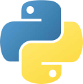&nbsp;&nbsp;
  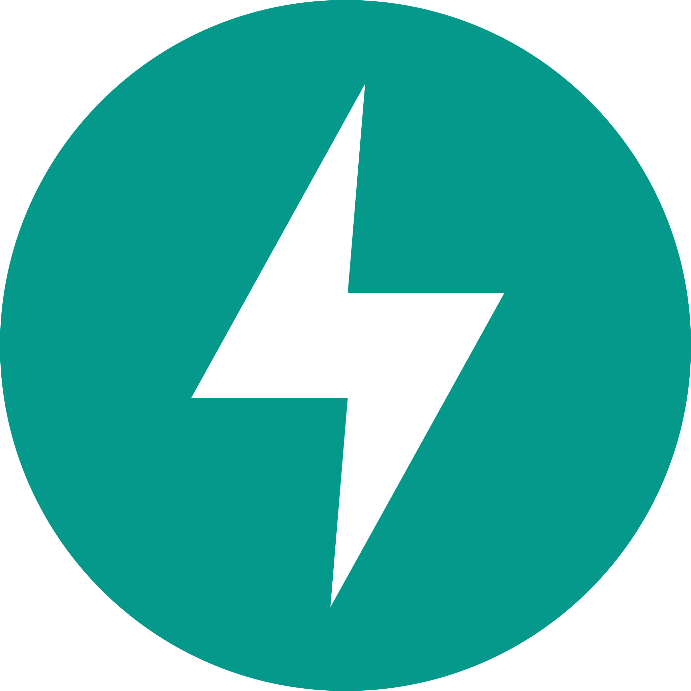&nbsp;&nbsp;
  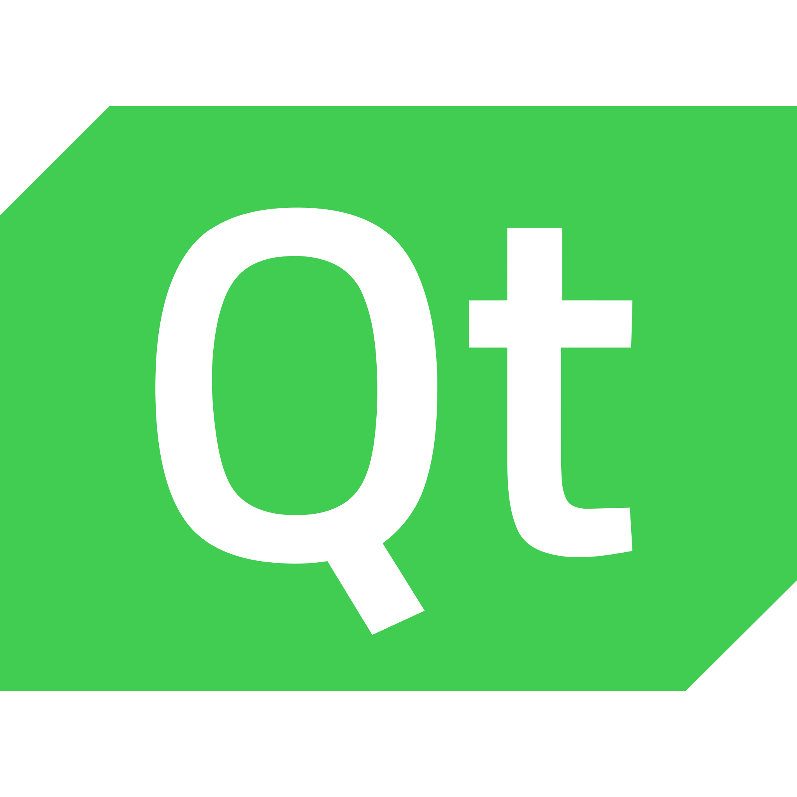&nbsp;&nbsp;
  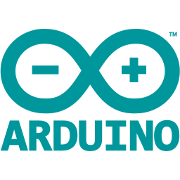&nbsp;&nbsp;
  &nbsp;&nbsp;
  &nbsp;&nbsp;
  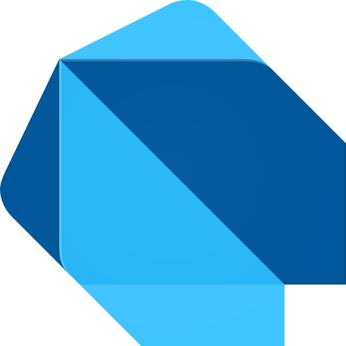&nbsp;&nbsp;
  &nbsp;&nbsp;
  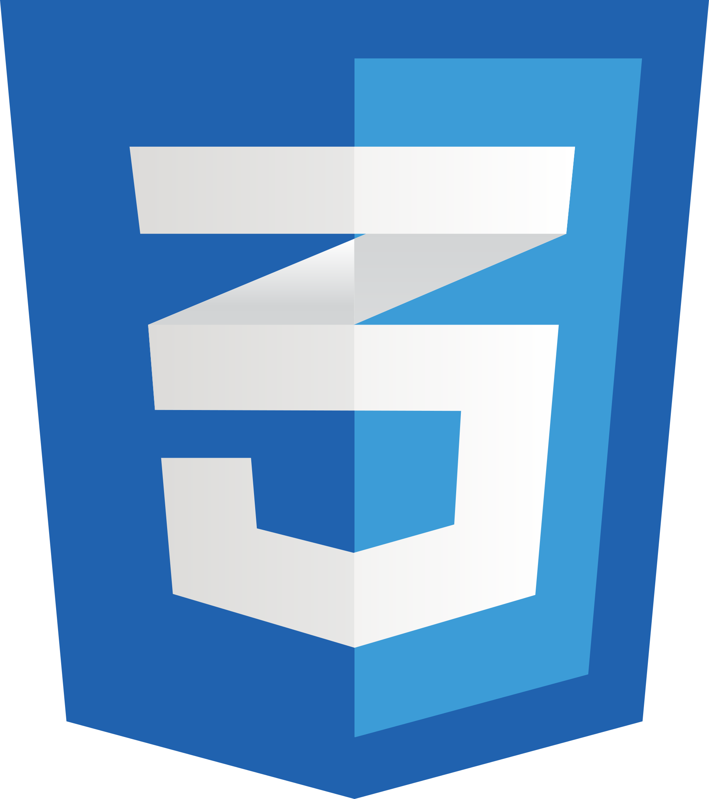&nbsp;&nbsp;
  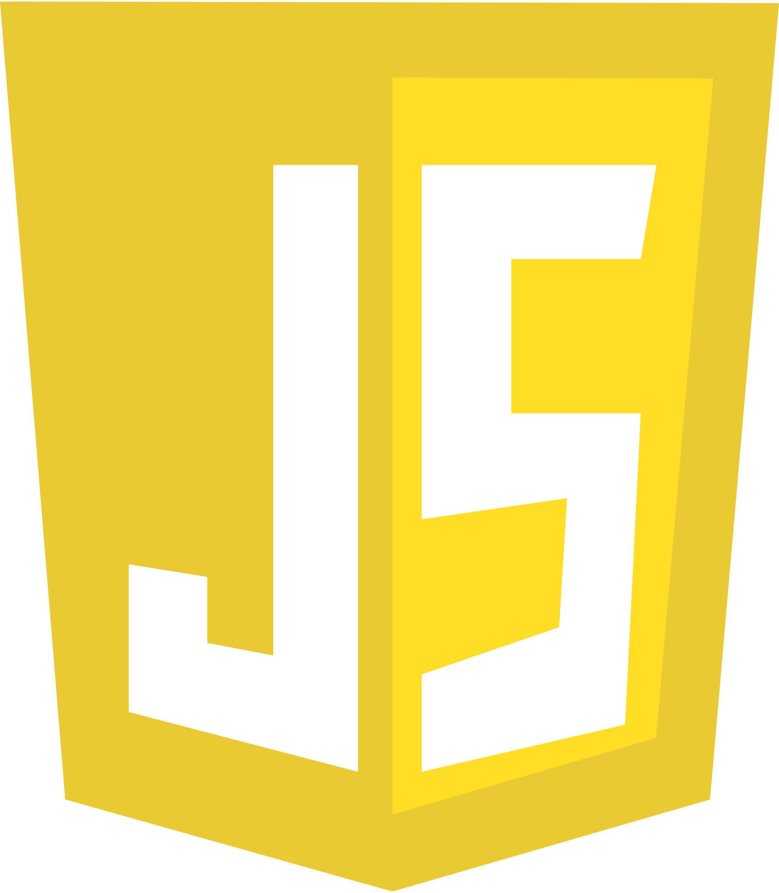&nbsp;&nbsp;
  &nbsp;&nbsp;
  &nbsp;&nbsp;
  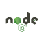&nbsp;&nbsp;
  &nbsp;&nbsp;
  &nbsp;&nbsp;
  &nbsp;&nbsp;
  &nbsp;&nbsp;
  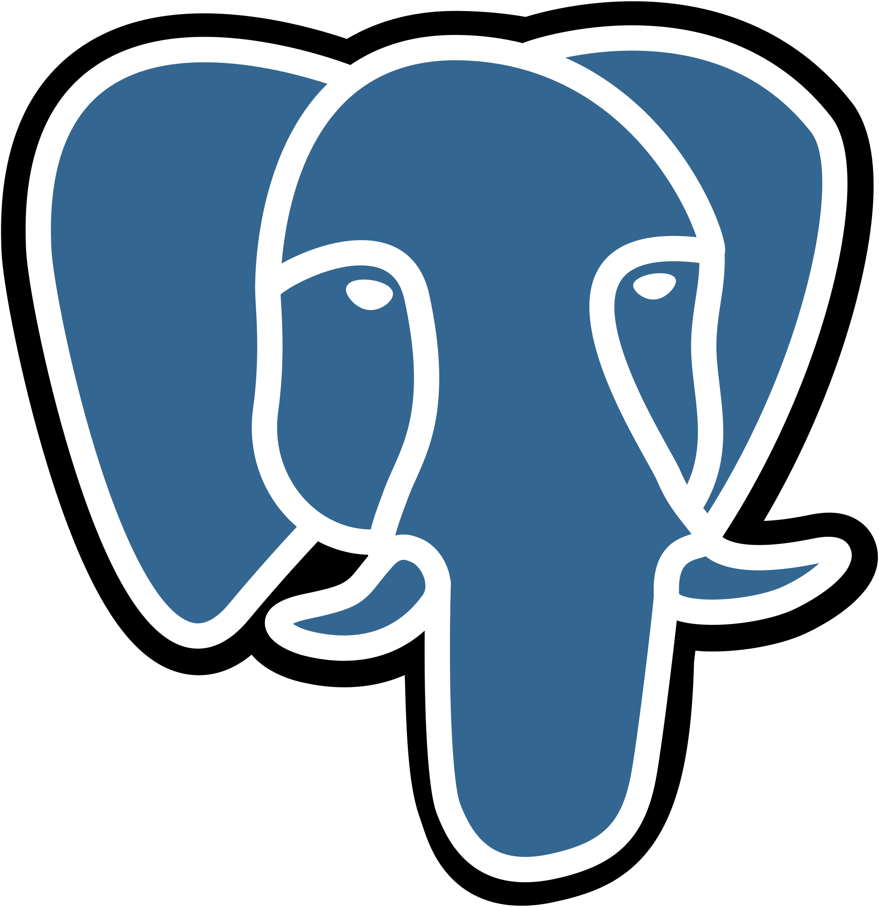&nbsp;&nbsp;
  &nbsp;&nbsp;
  &nbsp;&nbsp;
  &nbsp;&nbsp;
  &nbsp;&nbsp;
  &nbsp;&nbsp;
  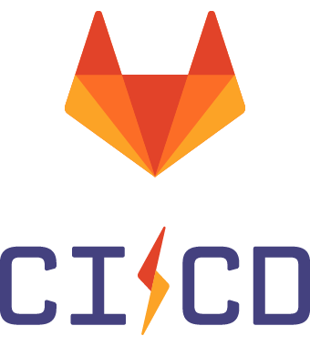&nbsp;&nbsp;
  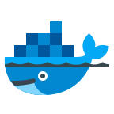&nbsp;&nbsp;
  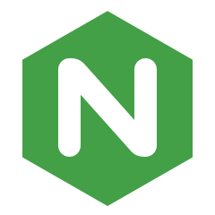&nbsp;&nbsp;
  &nbsp;&nbsp;
  &nbsp;&nbsp;
  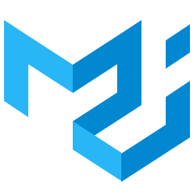&nbsp;&nbsp;
  &nbsp;&nbsp;
  &nbsp;&nbsp;
  &nbsp;&nbsp;
  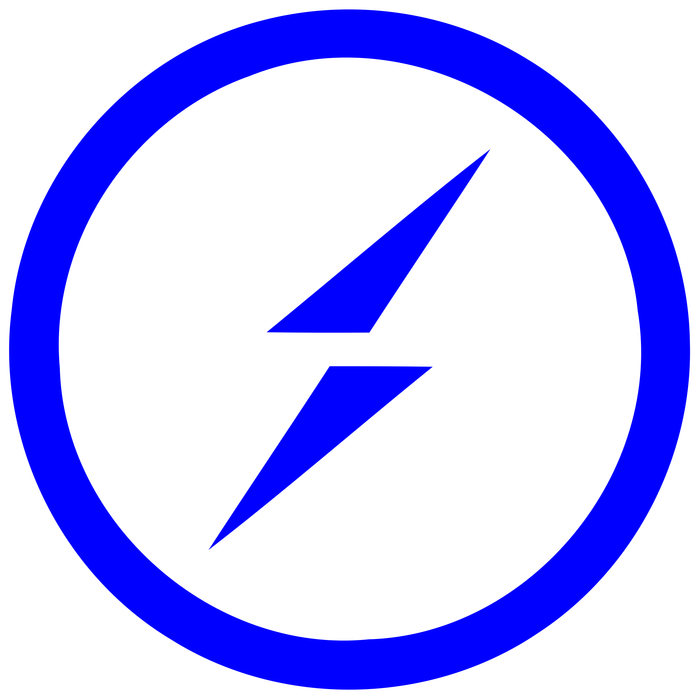&nbsp;&nbsp;
  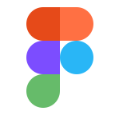&nbsp;&nbsp;
  &nbsp;&nbsp;
  &nbsp;&nbsp;

---

<!-- ### 🔥 Stats :

  

  

 -->